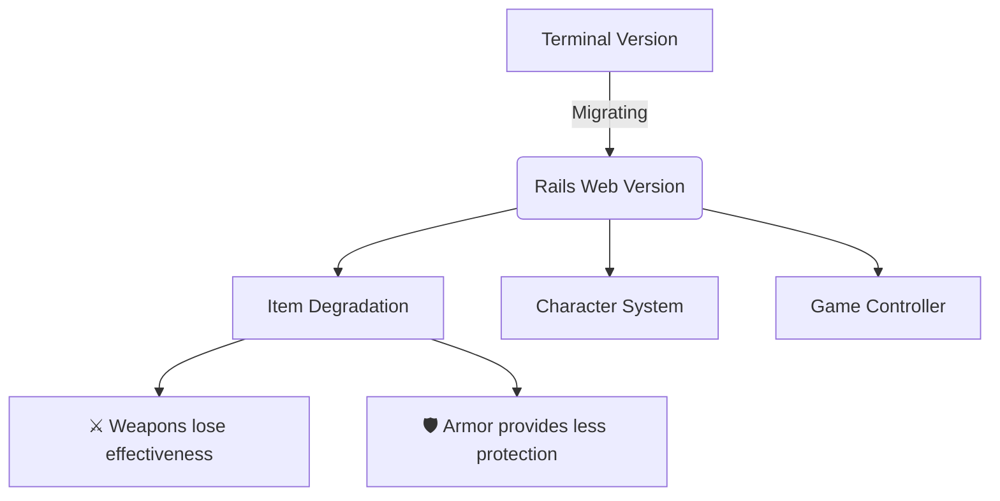

# D&D Rails Adventure

  

A work-in-progress Rails adaptation of my terminal-based D&D game - eventually evolving into a full web adventure

## 🎲 Current State (Alpha)
This is an active learning project where I'm transitioning my Ruby terminal game to a Rails web application. The most developed feature is the progressive item degradation system.


## 🏗️ Implemented Features
### 🔧 Core Systems
- Item degradation mechanics
  - Weapons lose effectiveness with use
  - Armor provides less protection over time
  - Visual indicators of item condition
- Basic character controller
- Game state management

## 💎 Technical Highlights
```ruby
# Example of item degradation logic
def use_item
  @item.durability -= rand(1..3)
  if @item.durability <= 0
    @item.update(equipped: false, broken: true)
    "Your #{@item.name} broke!"
  end
end
```

## 🌱 Planned Evolution
### Gameplay Systems
| System              | Status    | Description                          |
|---------------------|-----------|--------------------------------------|
| Character Progression | Planned   | Stats, levels, and XP               |
| Inventory           | Planned   | Equipment management                |
| Quest Journal       | Planned   | Track objectives and rewards         |
| Combat Engine       | Research  | Turn-based battle system             |

### Technical Roadmap
- Phase 1 (Current)
  - Core game loop migration
  - Item system refinement

- Phase 2 (Next)
  - React frontend integration
  - D&D 5e API connection
  - Save/load functionality

- Phase 3 (Future)
  - Multiplayer support
  - Interactive map
  - Audio/visual enhancements
 
### 🛠️ Development Setup
#### Prerequisites
- Ruby 3.x
- Rails 7
- PostgreSQL

#### Installation
```bash
git clone https://github.com/yourusername/dnd-rails-adventure.git
cd dnd-rails-adventure
bundle install
rails db:create db:migrate
rails s
```

## 🤝 Contributing Guidelines
While this is primarily a personal project, I welcome:
- Bug reports via Issues
- Suggestions for game mechanics
- Code contributions for isolated features

Please note the project is in early development, so major architecture changes are likely.

## 📜 Project Philosophy
This project follows vertical slice development:
- Build one complete system at a time
- Make it functional before pretty
- Learn through implementation

###### Built with ❤️ & 20-sided dice by Ana - 2025
